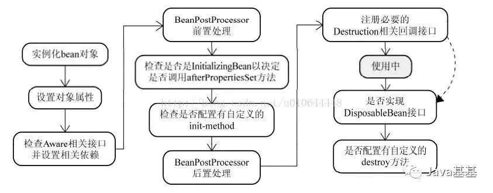
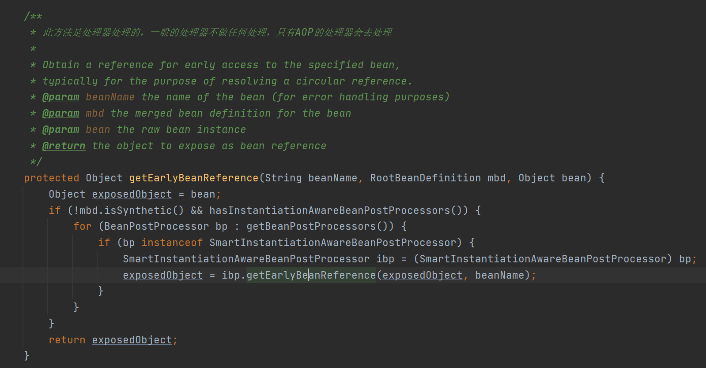
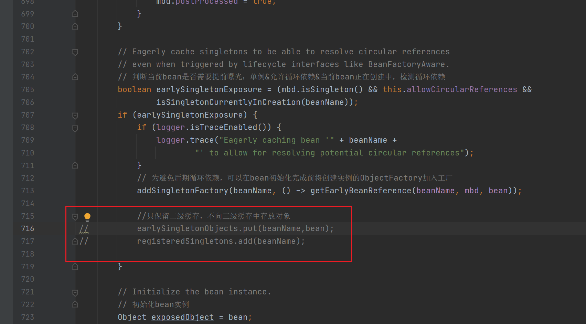

[toc]

### 待整理

### 1.反射

没有反射就没有面向对象，Spring 的ioc容器创建对象都是依赖反射技术。

**需要掌握反射创建对象的方式**，获取类的class对象的三种方式

​			//1.源头：获取Class对象，用三种方式
​    		Phone iPhone=new Phone();
​    		//1.1.对象.getClass();获取对象
​    		Class<?> clazz1 = iPhone.getClass();
​    		//1.2.类名.class
​    		 clazz1=Phone.class;
​    		//1.3.Class.forName("包名.类名");
​    		clazz1 = Class.forName("test.Phone");

```java
		//2.创建对象
		//2.1直接class对象newInstence()(已被弃用) 
		Phone instance1 = (Phone) clazz1.newInstance();
		//2.2先调用构造器，再通过newInstence()创建
		Object instance2 = clazz1.getConstructor().newInstance();
```
### 4.refresh()方法的13个子方法的作用以及大致过程

### 5.为什么set()方法可以解决循环依赖的问题，但是构造方法不行？

Spring通过DI（依赖注入）实现IOC（控制反转），常用的注入方式主要有三种：构造方法注入，setter注入，基于注解的注入。

> 基于注解的注入主要包括：@Resource（java的注解，默认以byName方式查找，没找到继续以不要byType的方式查找）和@Autowired(spring注解)，默认以byType的方式查找
>
> 以上两个注解都可以结合@Qualifier（beanName）注解精准查找指定的bean



Spring循环依赖可能出现的三种方式

> **第一种：构造器参数循环依赖**
> **第二种：setter方式单例，singleton(默认)** 
> **第三种：setter方式原型，prototype**
>
> 当Spring上下文在加载所有的bean时，他会尝试按照他们他们关联关系的顺序进行创建。比如，如果不存在循环依赖时，例如：
> Bean A → Bean B → Bean C
> 　　Spring会先创建Bean C，再创建Bean B（并将Bean C注入到Bean B中），最后再创建Bean A(并将Bean B注入到Bean A中)。
> 但是，如果我们存在循环依赖，Spring上下文不知道应该先创建哪个Bean,因为它们依赖于彼此。在这种情况下，Spring会在加载上下文时，抛出一个**BeanCurrentlyInCreationException。**

从上面的bean的创建流程可以看出Spring先用构造方法实例化Bean对象，在调用构造方法的时候发现需要依赖其他的对象，但是这个时候其他的对象还未被实例化，于是就出现了循环依赖的问题。

为什么set方式就不会出现循环依赖的问题呢？首先需要明确的是，Spring解决循环依赖的思路是将对象的实例化和初始化分开，并且提前对外暴露实例化后的对象。结合上面的图，Spring先用构造方法实例化Bean对象，此时Spring会将这个实例化结束的对象放到一个Map中，并且Spring提供了获取这个未设置属性的实例化对象的引用的方法。而对于"prototype"作用域的Bean，Spring容器无法完成完成依赖注入，因为该作用域的Bean，Spring容器不会进行缓存，因此无法提前暴露一个创建中的Bean。

[参考文章](https://blog.csdn.net/u010644448/article/details/59108799)

### 7.懒加载可以解决循环依赖的问题吗?

如下代码 A对象依赖B对象，但是在A的构造方法中，B对象被@Lazy修饰了，这样即便是构造方法注入也不会产生循环依赖的问题。

> **@Lazy注解注解的作用主要是减少springIOC容器启动的加载时间**
>
> **当出现循环依赖时，也可以添加@Lazy**

```java
@Component
public class CircularDependencyB {
 
    private CircularDependencyA circA;
 
    @Autowired
    public CircularDependencyB(CircularDependencyA circA) {
        this.circA = circA;
    }
}
```


```java
@Component
public class CircularDependencyA {
 
    private CircularDependencyB circB;
 
    @Autowired
    public CircularDependencyA(@Lazy CircularDependencyB circB) {
        this.circB = circB;
    }
}
```
### 8.三级缓存的ObjectFactory()是什么东西？

是一个函数式接口，仅有一个方法，可以传入一个lambda表达式，可以是匿名内部类，通过调用getObject方法来执行具体的逻辑。

Spring创建对象之前都是先从容器中查找，查找不到就创建

getBean() -> doGetBean() -> createBean->doCreateBean

从三级缓存中查找数据，先查找一级缓存，再查找二级缓存，最后从三级缓存中查找

### 10.只使用一级缓存能否解决循环依赖的问题？

不能，在整个处理过程中，缓存中 放的是半成品和成品对象，如果只有一级缓存，那么半成品和成品对象都会放到一级缓存中，有可能在获取过程中获取到半成品对象，此时半成品对象属性为null，不能直接进行相关的处理，因此要把半成品和成品存放的空间分隔开来。

### 11.只使用二级缓存行不行？为什么一定要用三级缓存？

**Spring中的三级缓存**

> 一级缓存：singletonObjects，存放**初始化**后的单例对象
> 二级缓存：earlySingletonObjects，存放**实例化**，未完成初始化的单例对象（未完成属性注入的对象）
> 三级缓存：singletonFactories，存放ObjectFactory对象
> 都是Map集合
> 单例对象先实例化存在于singletonFactories中，后存在于earlySingletonObjects中，最后初始化完成后放入singletonObjects中。

如果可以保证所有的bean对象都不去调用getEarlyReference这个方法，使用二级缓存是可行的。使用三级缓存的本质在于使用AOP代理问题。

**使用二级缓存也可以分为两种：使用singletonObjects和earlySingletonObjects，或者使用singletonObjects和singletonFactories。**

**①使用singletonObjects和earlySingletonObjects**
成品放在singletonObjects中，半成品放在earlySingletonObjects中

流程可以这样走：实例化A ->将半成品的A放入earlySingletonObjects中 ->填充A的属性时发现取不到B->实例化B->将半成品的A放入earlySingletonObjects中->从earlySingletonObjects中取出A填充B的属性->将成品B放入singletonObjects,并从earlySingletonObjects中删除B->将B填充到A的属性中->将成品A放入singletonObjects并删除earlySingletonObjects。

这样的流程是线程安全的，不过如果A上加个切面（AOP），这种做法就没法满足需求了，因为earlySingletonObjects中存放的都是原始对象，而我们需要注入的其实是A的代理对象。

**②使用singletonObjects和singletonFactories**
成品放在singletonObjects中，半成品通过singletonFactories来获取

流程是这样的：实例化A ->创建A的对象工厂并放入singletonFactories中 ->填充A的属性时发现取不到B->实例化B->创建B的对象工厂并放入singletonFactories中->从singletonFactories中获取A的对象工厂并获取A填充到B中->将成品B放入singletonObjects,并从singletonFactories中删除B的对象工厂->将B填充到A的属性中->将成品A放入singletonObjects并删除A的对象工厂。

同样，这样的流程也适用于普通的IOC已经有并发的场景，但如果A上加个切面（AOP）的话，这种情况也无法满足需求。

根据源码可知从singletonFactories获取对象时候会对对象进行增强处理，动态代理也是在这一步完成的。



### 12.如果某个bean对象为代理对象，那么会不会创建普通的bean对象呢？

会，先会创建一个普通对象再根据对象的定义判断是否要生成代理对象

### 13.为什么使用了三级缓存就可以解决aop代理的问题？

当一个对象需要被代理的时候，在整个创建过程中是包含了两个对象，一个是普通对象，一个是代理生成的对象，两个bean都是默认单例的，在整个生命周期的处理环节中，一个bean name不能对应两个对象？在bean的使用过程中需要加一层判断，判断一下是否需要进行代理的处理。

### 14.如何只使用二级缓存解决循环依赖？

思路：直接删除第三级缓存，对象实例化以后首先将属性值为空的对象（不是lambda表达式）放进二级缓存，重写getSingleton（）方法，只从一二级缓存获取依赖对象。

解决方式：

第一步：



第二步：

```java
@Nullable
protected Object getSingleton(String beanName, boolean allowEarlyReference) {
   Object singletonObject = this.singletonObjects.get(beanName);
   if (singletonObject == null && isSingletonCurrentlyInCreation(beanName)) {
         synchronized (this.singletonObjects) {
            singletonObject = this.earlySingletonObjects.get(beanName);
            return singletonObject;
         }
      }
   return singletonObject != null ? singletonObject:null;
}
```

### 15.循环依赖+aop的三级缓存保存的对象过程

