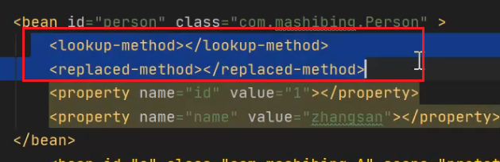
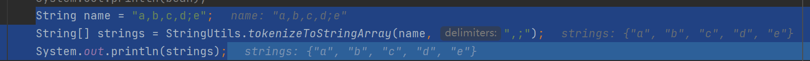

1.类的继承图怎么看？
绿色实线 绿色虚线  蓝色实线 
ctrl alt shift u
2.beanFactoryPostProcessor和BeanPostProcessor 都是用来增强bean的
他们的不同呢？
BeanPostProcessor 生成代理对象
BeanFactoryPostProcessor 修改beanDefinition信息 比如从配置文件中加载属性值的placeholderconfiguresupport
BeanPostProcessor 修改bean信息
3.Aware接口到底有什么作用？
看Aware接口的注释
 当Spring容器创建的bean对象在进行具体操作的时候，如果需要容器的其他对象，此时可以实现aware接口满足当前的需要
4.Spring bean分为普通对象和容器对象
5.beanFactory 中定义了Bean初始化的生命周期方法执行顺序（80行）
6.BeanFActory 和FactoryBean区别 FactoryBean 包含了三个方法？
都是用来创建对象的
当使用beanFactory的时候必须要
7.rootbeandefinition和genericbeandefinition区别
8.@ordered?
9.bfpp结束以后，实例化之前，需要执行listener相关的代码
bfpp结束以后，因为bean的初始化需要用到bpp，所以需要先将bpp实现并注册到容器中
10.了解bfpp是如何修改bean的定义的？
11.创建bean的时候为什么要先判断一下是不是beanfactory对象？

12.扩展实现customizeBeanFactory方法

​		此方法是用来实现BeanFactory的属性设置，主要是设置两个属性：

​		allowBeanDefinitionOverriding：是否允许覆盖同名称的不同定义的对象

​		allowCircularReferences：是否允许bean之间的循环依赖



13.指定对各字符对字符串进行切割

```java
String name = "a,b,c,d;e";
String[] strings = StringUtils.tokenizeToStringArray(name, ",;");
System.out.println(strings);
```



14.